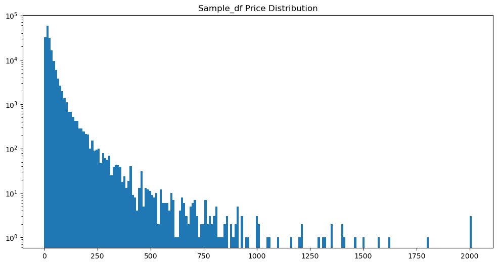
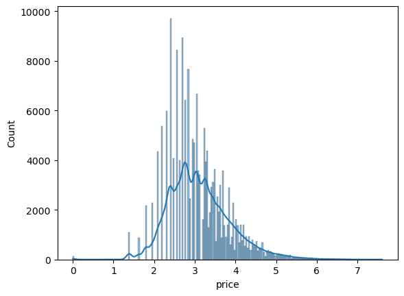

# 📌 Price Prediction for E-Commerce

This project aims to leverage data science techniques to automate price prediction for e-commerce products, enhancing pricing accuracy and competitiveness.

---

## 📄 Executive Summary

### Problem Statement

Many e-commerce businesses struggle to find the best prices for their products. They spend significant time and money researching prices to stay competitive. Additionally, e-commerce platforms with high product turnover face challenges in pricing new items accurately and quickly.

Incorrect pricing can lead to missed sales if the product is priced too high or loss of profit if priced too low.

---

### Data Science Opportunity

The proposed solution is to **automate price prediction** by analyzing historical product data and training a model that predicts optimal prices based on product attributes like name, category, description, and brand.

- Utilizing **NLP techniques** for feature extraction and preprocessing.
- Developing a model capable of providing accurate price predictions based on extracted features.

---

### Project Takeaways

- **Increased Revenue**: Effective price optimization aligns prices with demand and product specifications.
- **Data-Driven Decision Making**: Avoids guesswork and enhances strategy formulation.
- **Adaptive Models**: Implementing appropriate models ensures strategies are aligned with market trends.

---

## 🚧 Current Progress

This project is currently in the **modeling and evaluation phase**. Below is a summary of completed tasks and next steps.

### ✅ Completed

- **Data Cleaning and Preprocessing**
- **Exploratory Data Analysis (EDA)**
- **Log Transformation**: Normalizing the target variable improved model performance.
- **Text Preprocessing**: Using `CountVectorizer` and token prefixing for context.
- **Baseline Modeling**: Implemented models include Linear Regression, Random Forest, and XGBoost.
- **Model Evaluation**: Metrics used include `R²`, `RMSE`, and `MAE`.
- **Feature Importance Analysis**: Analysis from various models to identify key features.

### 🔄 Next Steps

- **Expand Training Samples**: Utilizing more data to improve model generalization.
- **Advanced NLP Techniques**: Implementing `SpaCy` for better feature extraction.
- **Hyperparameter Tuning and Model Selection**: Refining models for improved accuracy.

---

## 📈 EDA Insights

Here are some key insights discovered during the exploratory data analysis phase:

### 🎯 Target Variable Distribution (Before and After Log Transformation)

The price variable was highly skewed. Applying a log transformation helped achieve a more normal distribution, improving model performance.

- **Before Log Transformation**

  

- **After Log Transformation**

  

---

### 🧾 Most Frequent Tokens by Text Column

The most common tokens across product descriptions, names, brands, and categories reveal strong signals, especially from brand and category fields.

---

## 📊 Model Comparison

### Best Model: Linear Regression with L2 Regularization (Ridge Regression)

- **Performance Metric:**
  - Mean Absolute Error (MAE): **13.84**
  - Interpretation: The model's price predictions are, on average, **$13.84 off**.

- **Challenges & Improvements:**
  - Initial Overfitting: Caused by dataset distribution and outliers.
  - **Solution:** Removed outliers and applied a log transformation to the target variable, resulting in significant improvement.

- **Visualization:**
  

---

## 📌 SHAP Values Analysis

### Insights from SHAP Values:

- SHAP values identified the **most important numerical features**:
  - `Shipping` and `item_condition_id` were the most influential.
- Understanding feature importance highlighted the need for polynomial features to relate numerical variables with tokens for better pattern recognition.

### Challenges with Polynomial Features:

- Polynomial features require significant memory and computational power.
- Due to these limitations, full implementation has not yet been achieved.
- Proper implementation could significantly improve model performance.

---

## 📁 Project Organization

